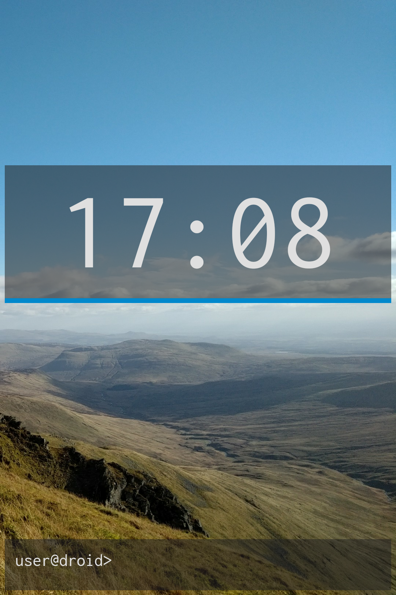
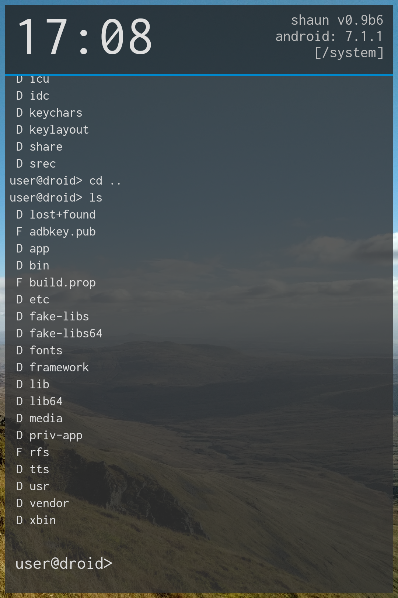

<h1 align="center">SHAUN</h1>

<b>SH</b>ell l<b>AUN</b>cher

  
  

                                                         
A minimal Android launcher consisting of an auto-completing application search+launch field... a command prompt. The goal is to create an easily usable, terminal emulator (+ shell), usable as a means of accessing apps on Android.

There are some major security limitations on Android apps imposed by Google... which makes sense, but will limit the functionality of the emulator.

<h4>Why is this a thing?</h4>
Given that the goal of touchscreens has been to get **away** from keyboards, this may seem like a counter intuitive approach to the homescreen. Some new phones are being released with *physical keyboards* again (not much of a [growth market](https://trends.google.com/trends/explore?date=all&q=physical%20keyboard) but blackberry seem pretty confident its [still a thing](https://www.blackberrymobile.com/uk/keyone/)). Physical keyboards allow the user a great opportunity for workflow enhancement, faster accessing of a great array of shortcuts. Typing four keys (`c-h-r-<RET>` tab-completes to `chrome`) can be a lot faster than opening up an app drawer, finding the desired app, and then pressing it. Chrome is maybe a bad example, most people have their web browser as a shortcut on their main homescreen. So this may be slower. 

<h4>The Prompt</h4>
What about the lesser used applications? What about Messenger? Sure, thats on their. Whatsapp too? What about SMS? That's a lot of messaging apps! What about Facebook? And Twitter? And Instagram? All on there? Jeez, that home screen is getting cluttered! This is where the power of the prompt comes in. From the prompt, three letters is most of all it takes to launch to get to your favourite apps. 

<h4>Aliases</h4>
Cool, but what about the shortcut apps? Our most used apps we want to secure quick access to. Aliases can help with that! Aliasing the letter `c` to `chrome` means that it takes three key strokes to launch your web browser. *(upcoming feature)*

<h4>Who is this for?</h4>
In short, the on-the-go power user. Someone who doesn't mess about with fancy app drawers and complicated gestures to get to their apps. Someone who wants to get things done with a minimum of fuss, but with a modicum of elegance and retro style. Of course, its also for the shell nerd. Do you not feel comfortable away from a VT102? Not to fear, SHAUN is here!

<h1 align="center">Features</h1>

  * Launching of apps (with "tab" completion).
    * Start typing the name of an app, press enter to find the name of the app, enter again to launch the app.
    * use "url" to view a webpage with the default web browser
  * Can browse the filesystem:
    * "cd": change directory relative to current
    * "ls": list contents of current directory
  * Clean UI design
  * Apps launched with the stroke of but a few keys (thanks to the command line)
  
<h1 align="center">Upcoming Features</h1>

  * User-editable aliases
  * Theming
  * Extensions
