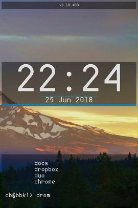

<h1 align="center">SHAUN</h1>

<b>SH</b>ell l<b>AUN</b>cher

  

<h4 align="center">What is it?</h4>

A minimal Android launcher consisting of an auto-completing application search+launch field... simmilar to a command shell.

<h4 align="center">Why?</h4>

It's faster.

Given that the goal of touchscreens has been to get **away** from keyboards, this may seem like a counter intuitive approach to the homescreen. Some new phones are being released with *physical keyboards* again (not much of a [growth market](https://trends.google.com/trends/explore?q=android%20physical%20keyboard&date=all) but blackberry seem pretty confident its [still](https://www.gsmarena.com/blackberry_passport-6457.php) [a](https://www.blackberrymobile.com/uk/keyone/) [thing](https://www.pocket-lint.com/phones/news/blackberry/143328-blackberry-key-2-specs-release-date-features-details)). Physical keyboards allow the user a great opportunity for workflow enhancement, faster accessing of a great array of shortcuts. Typing two keys (`c-<RET>` for `chrome`, for example) can be a lot faster than opening up an app drawer, finding the desired app, and then pressing it. 

Chrome is maybe a bad example, most people have their web browser as a shortcut on their main homescreen. However, what is something that you do as soon as you open your web browser? Search for something! Having your fingers primed at the ready on the keyboard means this launching method could prove faster afterall! Its worth a try at least.

What about the lesser used applications? What about Messenger? Sure, you have a shortcut for that. Whatsapp too? What about SMS? That's a lot of messaging apps! What about Facebook? And Twitter? And Instagram? All on there? Jeez, that home screen is getting cluttered! This is where the power of the prompt comes in. From the prompt, a few key presses is all it takes to launch to get to your favourite apps!

<h4 align="center">Who is this for?</h4>

Me, mostly. Or anyone who doesn't mess about with fancy app drawers and complicated gestures to get to their apps. Someone who wants to get things done with a minimum of fuss, but with a modicum of elegance and retro style. It is also made with the shell geek in mind. Do you feel uncomfortable away from a VT102? Not to fear, SHAUN is here!

<h1 align="center">Features</h1>

  * Launching of apps (with suggestions and auto-completion)
    * Completions appear above the prompt, press enter to launch the most similar option
    * Frequently used applications are given priority in completion list
  
<h4 align="center">Upcoming</h4>

  * Custom definable command aliases
  * Theming

<h1 align="center">Install</h1>

If you want to install the launcher download this repo, build the source, and transfer the APK to your phone.

I'm not all too familiar with the android build process at the moment. At the moment I stick to `C-F9` to get an output APK. So I don't want to commmit to providing pre-built APKs. Plus, your Android version may have some oddities that the version I tend to build to (Android 7.0, SDK ver 25) might not have. I do plan to perhaps put this onto Google Play at some point in the future, if it ever gets to a point where I'm happy with it.

<h1 align="center">Licence Stuff</h1>

SHAUN itself is GPL 3.0, and uses content as follows:

<h4 align="center"> Fonts </h4>

  * [DOS VGA 437](https://www.dafont.com/perfect-dos-vga-437.font) - Free
  * [Runescape UF](https://www.dafont.com/runescape-uf.font) - GPL/Public Domain (unclear)
  * [Inconsolata](https://levien.com/type/myfonts/inconsolata.html) - SIL Open Font License
  * [Drucifer](https://github.com/drucifer/drucifer-monospace) - SIL Open Font License

<h4 align="center"> Libraries </h4>

  * [FuzzyWuzzy](https://github.com/xdrop/fuzzywuzzy) - MIT License
